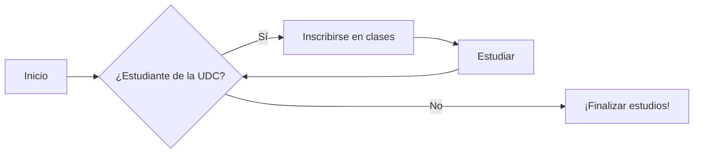
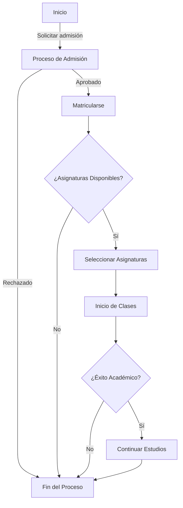

# Diagramas

Material for MkDocs ofrece integración con **Mermaid.js**, permitiendo incorporar diversos tipos de diagramas a tu documentación de proyecto. Aquí te presentamos cómo configurar y utilizar algunos de ellos.

## Configuración:

Para configurar los diagramas añadiremos lo siguiente a `mkdocs.yml`:

```yaml
markdown_extensions:
  - pymdownx.superfences:
      custom_fences:
        - name: mermaid
          class: mermaid
          format: !!python/name:pymdownx.superfences.fence_code_format
```

## Uso de diagramas

````markdown title="Diagrama de flujo"

````
<div class="result" markdown>


</div>

````markdown title="Diagrama entidad-relación"

````

<div class="result" markdown>


</div>

Existen más tipos de diagramas como secuencia, estado y clase. Para detalles adicionales y ejemplos, consulta la documentación de Mermaid.js [aquí](http://mermaid.js.org).


