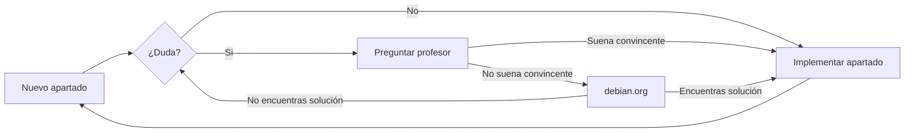
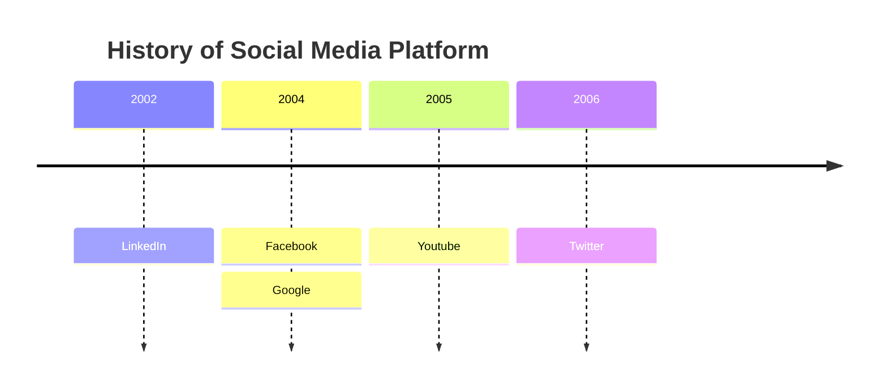

# Diagramas con mermaid

## Flowchart de LSI

``` mermaid
flowchart LR

A[Nuevo apartado] --> B{¿Duda?}

B--->|Si|C[Preguntar profesor]
B--->|No|D[Implementar apartado]
C-->|Suena convincente|D
C-->|No suena convincente|E[debian.org]
E-->|Encuentras solución|D
E-->|No encuentras solución|B
D-->A

```
## Diagrama de Gantt

```mermaid
gantt
    title Práctica I: Configuración básica
    dateFormat HH:mm

    Comienzo práctica       : milestone, m1, 17:49, 2m
    Configuración básica    : 1h
    Actualizar distro       : 1h
    Secuencia de arranque   : 2h
    Tiempos de botado y servicios : 1h
    Investigar servicios fallidos : 10h
    Configurar interfaz de red    : 3h
    Configurar rutas              : 5h
    Limpiar servicios innecesarios: 5h
    Diseñar y configurar script   : 10h
    Identificar conexiones de red  : 1h
    Monitorizar recursos del sistema : 4h
    Configurar tcp-wrapper        : 5h
    Configurar rsyslog y journald  : 3h
    Configurar IPv6 y pruebas      : 4h
    Configurar servidor y cliente NTPSec : 1h
    Configurar servidor y cliente de logs : 2h
    Identificar problemas de seguridad : 2h
    Reducir espacio en disco      : 3h
    Instalar SIEM Splunk          : 2h
    Configurar Splunk             : 2h
    Apagado de máquinas              : milestone, m2, 18:08, 4m


```

*Cualquier parecido con la realidad es mera coincidencia*

## Timeline example

```mermaid
timeline
    title History of Social Media Platform
    2002 : LinkedIn
    2004 : Facebook
         : Google
    2005 : Youtube
    2006 : Twitter
```