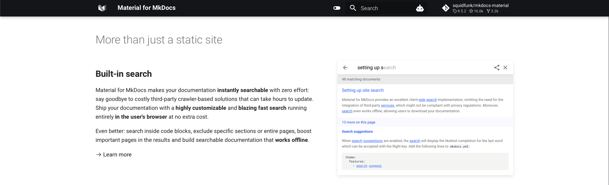

# Temas en MkDocs

MkDocs ofrece una variedad de temas que mejoran el aspecto visual y las funcionalidades de tu documentación. Uno de los más reconocidos es [Material for MkDocs](https://squidfunk.github.io/mkdocs-material/), el cual utilizaremos en este caso. Sin embargo, si decides optar por otro tema, la configuración podría variar y será necesario consultar los detalles específicos.

El tema *Material* proporcionará a nuestra página un diseño similar al siguiente:




## Instalación 

La forma más común de instalación es en base a `pip`:

```bash
pip install mkdocs-material
```

??? info "Otras formas de instalación"
    ### Instalación con Docker
    ```bash
    docker pull squidfunk/mkdocs-material
    ```

    ### Instalación con Git
    ```bash
    git clone https://github.com/squidfunk/mkdocs-material.git
    pip install -e mkdocs-material
    ```
